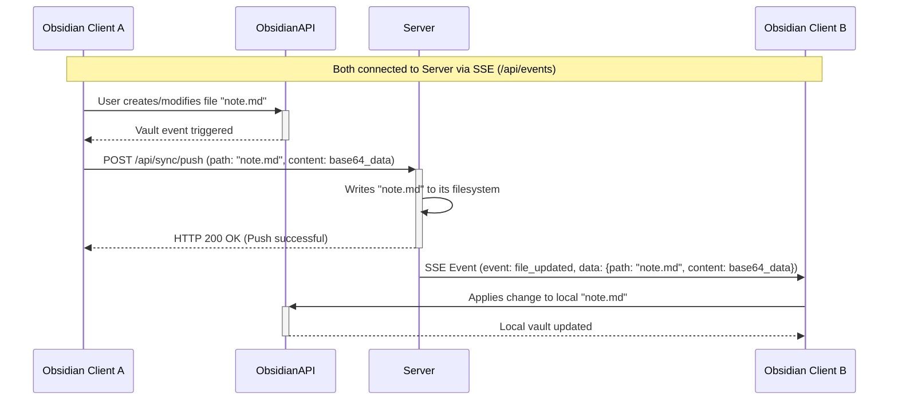
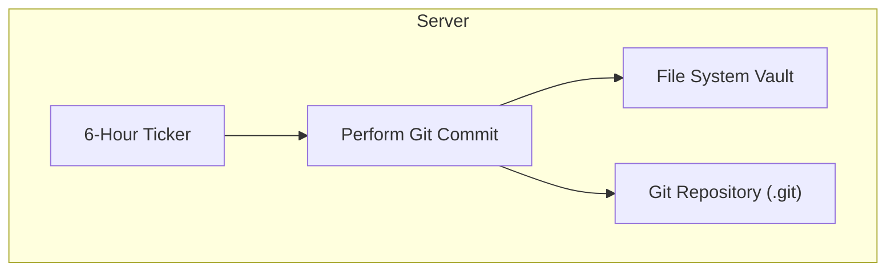

# Yamanaka - Self-Hosted Obsidian Sync

Yamanaka is a self-hosted synchronization solution for your Obsidian.md vault. It provides real-time, bi-directional sync across multiple devices, ensuring your notes are always up-to-date. File changes are transmitted instantly between clients using Server-Sent Events (SSE), while the backend server periodically creates Git commits for versioning and backup purposes.

## Features

*   **Real-time Sync:** Changes made on one device are instantly reflected on others via Server-Sent Events.
*   **Self-Hosted Server:** You control your data. The backend is a Go application that you can run on your own hardware or cloud server.
*   **Obsidian Plugin:** A companion plugin for Obsidian that handles local file watching, communication with the server, and applying remote changes.
*   **Periodic Git Commits:** The server automatically commits all changes to a Git repository every 6 hours, providing a version history for your vault.
*   **Simple Setup:** Uses a Go backend and an Obsidian plugin, with Docker support for easy server deployment.

## Architecture

The system consists of two main components:

1. **Backend Server (Go):**
    * Manages the central vault data on its filesystem.
    * Initializes a Git repository within its data directory for periodic versioning.
    * Exposes an HTTP API for:
        * Pushing/pulling file changes.
        * Initial vault synchronization.
        * Serving Server-Sent Events (SSE) for real-time updates.
    * Handles file operations (create, update, delete) from clients.
    * Broadcasts granular file change events (path, content for updates/creates, delete notifications) via SSE to all other connected clients.
    * A background goroutine performs a `git commit` operation every 6 hours. Git is **not** used for direct client-to-client sync determination.
2. **Obsidian Plugin (TypeScript):**
    * Installed in each Obsidian vault.
    * Generates a unique `deviceId`.
    * Watches the local vault for file changes (creates, modifications, deletions, renames).
    * Pushes local changes to the server's HTTP API.
    * Connects to the server's SSE endpoint (`/api/events`) to receive real-time updates about file changes from other clients.
    * Applies received SSE events (file updates, deletions) to the local vault.
    * Handles full sync requests when indicated by the server (e.g., after another client performs an initial sync).

### Data Flow for Real-time Sync:



### Periodic Git Commit (Server-Side):



Note: Git operations are independent of plugin operations.

## Installation

### 1. Backend Server Setup

**Requirements:**
*   Go (version 1.21+ recommended) or Docker.
*   Git installed on the server machine.

**Running with Docker (Recommended):**
1.  Ensure Docker is installed.
2.  Navigate to the `server/` directory in the project.
3.  Build the Docker image:
    ```bash
    docker build -t yamanaka-server .
    ```
4.  Run the Docker container:
    ```bash
    docker run -d -p 8080:8080 -v /path/to/your/desired/vault_storage:/app/data --name yamanaka yamanaka-server
    ```
    *   Replace `/path/to/your/desired/vault_storage` with the absolute path on your host machine where you want the server to store the Obsidian vault data (including its Git repository). This directory will be created if it doesn't exist.
    *   The server will be accessible on `http://<your_server_ip>:8080`.

**Running directly with Go:**
1.  Clone the repository.
2.  Navigate to the `server/` directory.
3.  Ensure Go is installed and configured.
4.  Build the server:
    ```bash
    go build -o yamanaka-server .
    ```
5.  Run the server:
    ```bash
    ./yamanaka-server
    ```
    *   This will create a `data/` subdirectory within the `server/` directory to store the vault.
    *   The server will run on `http://localhost:8080` by default.

### 2. Obsidian Plugin Setup

1.  Ensure you have Obsidian installed (version 0.15.0 or newer).
2.  Download the latest release of the Yamanaka plugin from the [releases page](https://github.com/your-repo/yamanaka/releases) (TODO: update link when releases are available).
    *   Alternatively, if you are developing or want the latest build:
        *   Clone this repository.
        *   Navigate to the `plugin/` directory.
        *   Install dependencies: `npm install`
        *   Build the plugin: `npm run build`
        *   This will create a `main.js`, `styles.css`, and `manifest.json` in the `plugin/` directory.
3.  Copy the plugin files (`main.js`, `styles.css`, `manifest.json`) into your Obsidian vault's plugin folder: `<YourVault>/.obsidian/plugins/yamanaka-self-hosted-sync/`. You might need to create the `yamanaka-self-hosted-sync` directory.
4.  Open Obsidian, go to `Settings` > `Community plugins`.
5.  Enable "Yamanaka" in the list of installed plugins.
6.  Open the Yamanaka plugin settings:
    *   Enter the **Server URL** (e.g., `http://your_server_ip:8080` or `http://localhost:8080` if running locally).
    *   Ensure "Auto Sync" is enabled for real-time updates.
    *   A unique Device ID will be automatically generated.

## Usage

*   **Automatic Sync:** Once configured, the plugin will automatically sync changes in real-time. When you create, modify, or delete files in your Obsidian vault, these changes will be pushed to the server and then broadcast to your other connected devices. Similarly, changes from other devices will be pulled down to your current vault.
*   **Manual Operations (Commands):**
    *   **Yamanaka: Manual Push:** Manually pushes any pending local changes to the server.
    *   **Yamanaka: Manual Pull:** Manually pulls the entire current state of the vault from the server. This is useful if you suspect a discrepancy or after a `full_sync_required` event.
*   **Initial Sync:** If you are setting up a new device or want to ensure the server has the exact copy of your current local vault, you can use the "Initial Sync" button in the plugin settings (TODO: Verify if this button exists or if manual push from a fresh client achieves this). This action will typically replace the server's current vault content with the content from the client performing the initial sync.

## Contributing

(TODO: Add contribution guidelines if desired)

## License

This project is licensed under the [MIT License](LICENSE).
