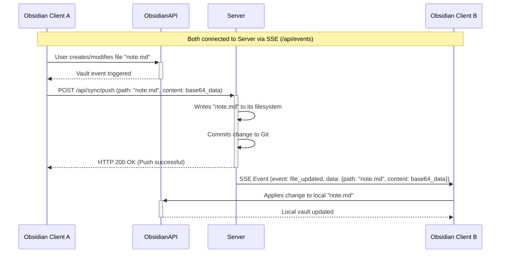

# Yamanaka - Self-Hosted Obsidian Sync

> This repository is entirely prepped by AI. This was by design, as I wanted to test the limits. However, testing and building follow certain paradigms. Expand the following to know more.

How I Architected This

I love Go and like to use it with self-hosting. I have more apps I worked on manually for self-hosting, but this was a test to see how far I could take a repo with basically just prompting and minimal efforts. I used Jules and Gemini to create this repo. I started with writing a long braindump of the entire architecture into Gemini, which took me about 35-40 minutes. In the architecture, I explained most of what this plugin is, using SSE and the Git commit for history preservation. Then I followed that with 2 Canvas sessions with Gemini to initialize the repo and fix some bugs. After that, I performed 4 tasks with Jules to fix further issues and add features. At the end, it was usable and worked quite well. This completely fixed my issues with obsidian sync and i didn't need to rely on any db or anything, just plaintext syncing, which also happens quite quickly due to sse. this was a fun experiment.

Yamanaka is a self-hosted synchronization solution for your Obsidian.md vault. It offers:
*   Real-time, bi-directional sync using Server-Sent Events (SSE).
*   Instantaneous backend updates and Git commits for versioning on every change.
*   A Go-based server and an Obsidian plugin.

## Quickstart

*   **Deploy Server:** Use Docker (see `server/Dockerfile`) or run the Go binary directly.
*   **Install Plugin:** Copy `main.js`, `styles.css`, `manifest.json` from `plugin/` to your vault's `.obsidian/plugins/yamanaka-self-hosted-sync/` directory.
*   **Configure Plugin:** In Obsidian settings, enable Yamanaka and set your server URL (e.g., `http://your_server_ip:8080`).
*   **Start Syncing:** Changes will sync automatically.

## Key Features

*   **Instant Sync:** Changes sync immediately across devices using Server-Sent Events (SSE).
*   **Self-Hosted Server:** Full control over your data with a Go-based backend.
*   **Obsidian Integration:** Companion plugin for seamless vault synchronization.
*   **Version History:**
    *   Server commits changes to Git *instantly* upon receiving them from a client.
    *   Additionally, a periodic Git commit (every 4 hours by default) ensures any other changes are captured.
*   **Easy Deployment:** Docker support for server and simple plugin install.

## Architecture Overview

Yamanaka uses a client-server model:

*   **Backend Server (Go):**
    *   Manages the central vault on its filesystem.
    *   Uses Git for versioning:
        *   Commits changes immediately when pushed by a client.
        *   Performs a periodic commit (default: every 4 hours) as a fallback.
    *   Provides an HTTP API for:
        *   File synchronization (push/pull).
        *   Initial vault setup.
        *   SSE for real-time updates.
    *   Broadcasts file changes via SSE to other connected clients.
*   **Obsidian Plugin (TypeScript):**
    *   Watches for local file changes (create, modify, delete, rename).
    *   Pushes these changes to the server.
    *   Subscribes to server's SSE feed for remote changes and applies them locally.

### Data Flow for Real-time Sync (User Interaction Diagram)

## Installation

### 1. Backend Server Setup

*   **Requirements:** Go (1.21+), Git.
*   **Docker (Recommended):**
    1.  Go to `server/` directory.
    2.  Build: `docker build -t yamanaka-server .`
    3.  Run: `docker run -d -p 8080:8080 -v /path/to/your/vault_storage:/app/data --name yamanaka yamanaka-server`
        *   Replace `/path/to/your/vault_storage` with your desired host path for vault data.
*   **Directly with Go:**
    1.  Navigate to `server/`.
    2.  Build: `go build -o yamanaka-server .`
    3.  Run: `./yamanaka-server` (data stored in `server/data/`).

### 2. Obsidian Plugin Setup

1.  Get plugin files (`main.js`, `styles.css`, `manifest.json`):
    *   Download from releases (TODO: Link).
    *   Or build from source: `cd plugin/`, `npm install`, `npm run build`.
2.  Copy to `<YourVault>/.obsidian/plugins/yamanaka-self-hosted-sync/`.
3.  In Obsidian: `Settings` > `Community plugins` > Enable `Yamanaka`.
4.  Configure plugin settings:
    *   **Server URL:** e.g., `http://your_server_ip:8080`.
    *   Enable **Auto Sync**.

## Usage

*   **Automatic Sync:** Enabled by default. File changes are synced in real-time.
*   **Manual Commands:**
    *   `Yamanaka: Manual Push`: Push local changes.
    *   `Yamanaka: Manual Pull`: Fetch entire vault from server.
*   **Initial Sync:**
    *   The plugin's "Initial Sync" button (in settings) will replace the server's vault with the current client's vault. Use with caution. (TODO: Confirm button existence/functionality based on latest plugin code).

## Contributing

(Details TBD)

## License

[MIT License](LICENSE).
