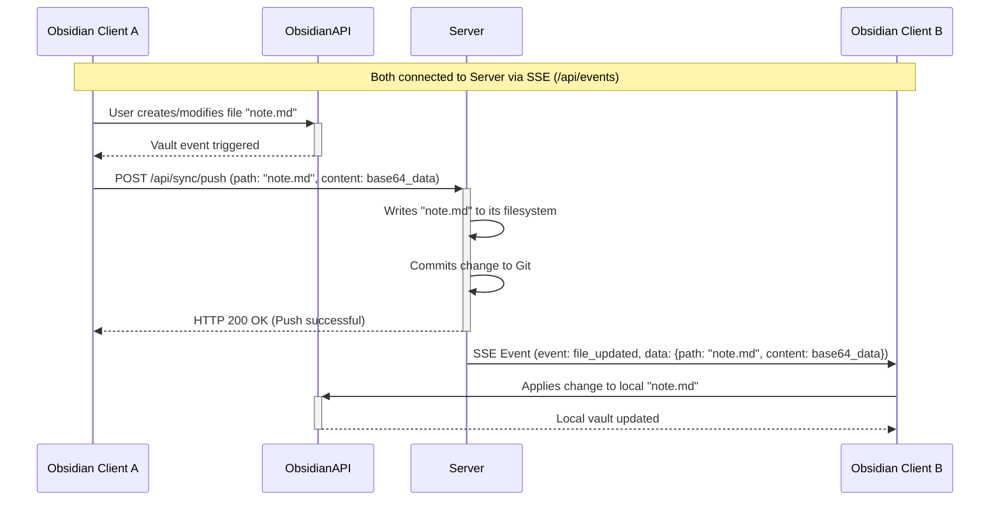

<h1 align="center">Yamanaka</h1>

&nbsp;&nbsp;

<b>Yamanaka</b> is a self-hosted synchronization solution for your Obsidian.md vault. Yes, Yamanaka clan from Naruto symbolizing information transfer.

> [!IMPORTANT]
> This repository was entirely prepped by AI. This was by design, as I wanted to test the limits of AI-driven development. While this project pushed those boundaries, the underlying testing and building processes still followed established architectural paradigms. Expand the following to learn more about its creation.

How I Architected This

I like Go and enjoy using it for self-hosted stuff. While I've manually built a couple self-hosted apps, this project was an experiment to determine how far I could get primarily through prompting, with minimal manual effort.

I used Google Gemini and Jules for this project. I began with a comprehensive 35-40 minute brain dump into Gemini, detailing the entire architecture and how I thought about the application, core functionality, use of Server-Sent Events (SSE), and Git commits for history preservation.

Following this, I conducted two Canvas sessions with Gemini to initialize the repository and address initial bugs. Then, I did four tasks with Jules to resolve more issues and add additional features.

The end result was a fully functional and highly effective solution. This approach completely resolved my issues with syncing on Obsidian, without any databases or complex mechanisms. A simple and fast plaintext syncing, exactly what I eanted. Overall, it was a truly enjoyable and insightful experiment.

---

Yamanaka is a self-hosted synchronization solution for your Obsidian.md vault. It offers:
*   Real-time, bi-directional sync using Server-Sent Events (SSE).
*   Instantaneous backend updates and Git commits for versioning on every change.
*   A Go-based server and an Obsidian plugin.

## Quickstart

*   **Deploy Server:** Use Docker (see `server/Dockerfile`) or run the Go binary directly.
*   **Install Plugin:** Copy `main.js`, `styles.css`, `manifest.json` from `plugin/` to your vault's `.obsidian/plugins/yamanaka/` directory.
*   **Configure Plugin:** In Obsidian settings, enable Yamanaka and set your server URL (e.g., `http://your_server_ip:8080`).
*   **Start Syncing:** Changes will sync automatically.

## Key Features

*   **Instant Sync:** Changes sync immediately across devices using Server-Sent Events (SSE).
*   **Self-Hosted Server:** Full control over your data with a Go-based backend.
*   **Obsidian Integration:** Companion plugin for seamless vault synchronization.
*   **Version History:**
    *   Server commits changes to Git *instantly* upon receiving them from a client.
    *   Additionally, a periodic Git commit (every 4 hours by default) ensures any other changes are captured.
*   **Easy Deployment:** Docker support for server and simple plugin install.

## Architecture Overview

Yamanaka uses a client-server model:

*   **Backend Server (Go):**
    *   Manages the central vault on its filesystem.
    *   Uses Git for versioning:
        *   Commits changes immediately when pushed by a client.
        *   Performs a periodic commit (default: every 4 hours) as a fallback.
    *   Provides an HTTP API for:
        *   File synchronization (push/pull).
        *   Initial vault setup.
        *   SSE for real-time updates.
    *   Broadcasts file changes via SSE to other connected clients.
*   **Obsidian Plugin (TypeScript):**
    *   Watches for local file changes (create, modify, delete, rename).
    *   Pushes these changes to the server.
    *   Subscribes to server's SSE feed for remote changes and applies them locally.

### Data Flow for Real-time Sync (User Interaction Diagram)

## Installation

### 1. Backend Server Setup

*   **Requirements:** Go (1.21+), Git.
*   **Docker (Recommended):**
    1.  Go to `server/` directory.
    2.  Build: `docker build -t yamanaka-server .`
    3.  Run: `docker run -d -p 8080:8080 -v /path/to/your/vault_storage:/app/data --name yamanaka yamanaka-server`
        *   Replace `/path/to/your/vault_storage` with your desired host path for vault data.
*   **Directly with Go:**
    1.  Navigate to `server/`.
    2.  Build: `go build -o yamanaka-server .`
    3.  Run: `./yamanaka-server` (data stored in `server/data/`).

### 2. Obsidian Plugin Setup

1.  Get plugin files (`main.js`, `styles.css`, `manifest.json`):
    *   Download from releases (TODO: Link).
    *   Or build from source: `cd plugin/`, `npm install`, `npm run build`.
2.  Copy to `<YourVault>/.obsidian/plugins/yamanaka-self-hosted-sync/`.
3.  In Obsidian: `Settings` > `Community plugins` > Enable `Yamanaka`.
4.  Configure plugin settings:
    *   **Server URL:** e.g., `http://your_server_ip:8080`.
    *   Enable **Auto Sync**.

## Usage

*   **Automatic Sync:** Enabled by default. File changes are synced in real-time.
*   **Manual Commands:**
    *   `Yamanaka: Manual Push`: Push local changes.
    *   `Yamanaka: Manual Pull`: Fetch entire vault from server.
*   **Initial Sync:**
    *   The plugin's "Initial Sync" button (in settings) will replace the server's vault with the current client's vault. Use with caution. (TODO: Confirm button existence/functionality based on latest plugin code).

## Contributing

As mentioned earlier, this is an AI-experiment repository. That said, since the plugin works properly, contributions are welcome and I will manually review and merge going forward. Please note, unlike most projects, this is meant to be an application that works only for myself, but if someone gets aid from it, that's great. Hence, the MIT license to support freedom. Feature additions, bug fixes, and meaningful contributions are welcome. If you want to discuss, feel free to open an issue and I'll be happy to discuss.
